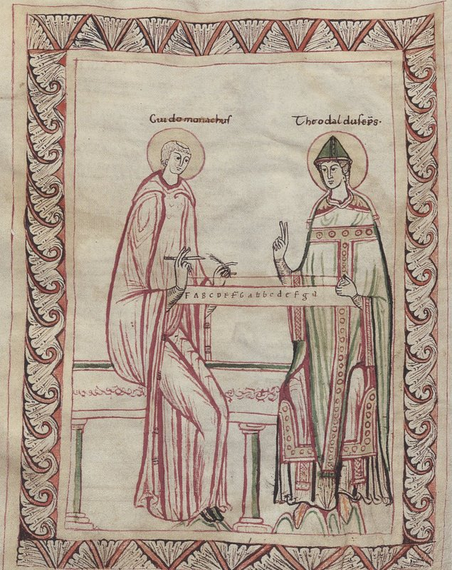
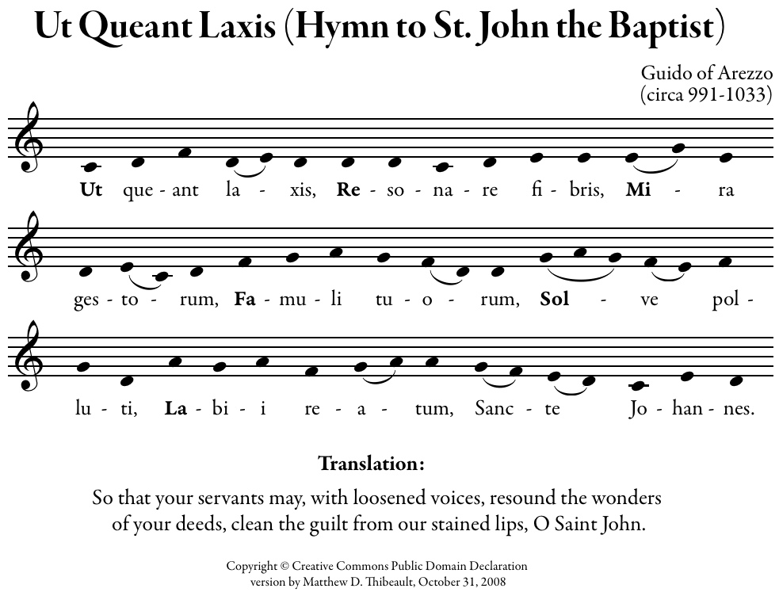
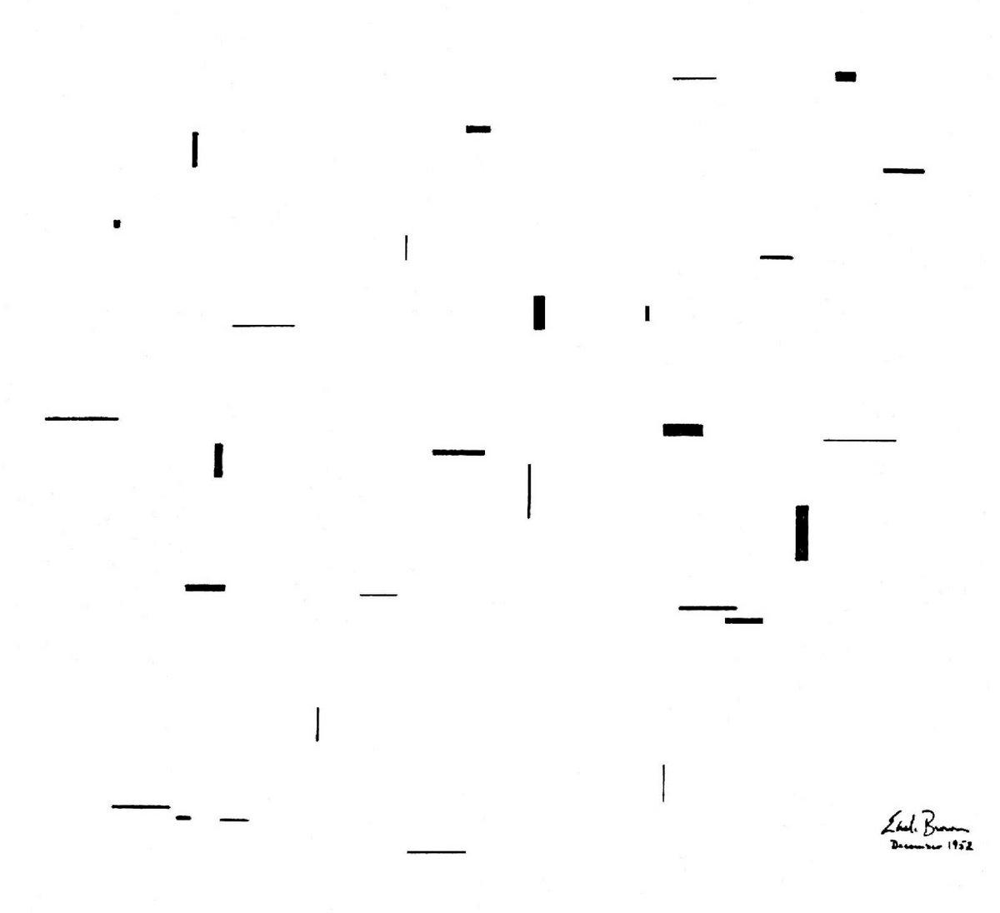

# Aufzeichnung und Anweisung in der Musik

## Introduction

Lorem ipsum dolor sit amet, consectetur adipiscing elit. Integer nec odio. Praesent libero.[^1] Sed cursus ante dapibus diam. Sed nisi. Nulla quis sem at nibh elementum imperdiet.

<!-- Fixed image path to use ../ for correct relative path from papers folder -->

Duis sagittis ipsum. Praesent mauris. Fusce nec tellus sed augue semper porta. Mauris massa. Vestibulum lacinia arcu eget nulla. 

Duis sagittis ipsum. Praesent mauris. Fusce nec tellus sed augue semper porta. Mauris massa. Vestibulum lacinia arcu eget nulla.

## Historical Context

Class aptent taciti sociosqu ad litora torquent per conubia nostra, per inceptos himenaeos.[^2] Curabitur sodales ligula in libero. Sed dignissim lacinia nunc.

Curabitur tortor. Pellentesque nibh. Aenean quam. In scelerisque sem at dolor. Maecenas mattis. Sed convallis tristique sem. Proin ut ligula vel nunc egestas porttitor.

Morbi lectus risus, iaculis vel, suscipit quis, luctus non, massa. Fusce ac turpis quis ligula lacinia aliquet. Mauris ipsum. Nulla metus metus, ullamcorper vel, tincidunt sed, euismod in, nibh.[^3]

<!-- Fixed image path -->

Quisque volutpat condimentum velit. Class aptent taciti sociosqu ad litora torquent per conubia nostra, per inceptos himenaeos. Nam nec ante. Sed lacinia, urna non tincidunt mattis, tortor neque adipiscing diam.

## Conclusion

Lorem ipsum dolor sit amet, consectetur adipiscing elit. Proin pharetra nonummy pede. Mauris et orci. Aenean nec lorem. In porttitor.

[^1]: Reference 1.
[^2]: Reference 2.
[^3]: Reference 3.
