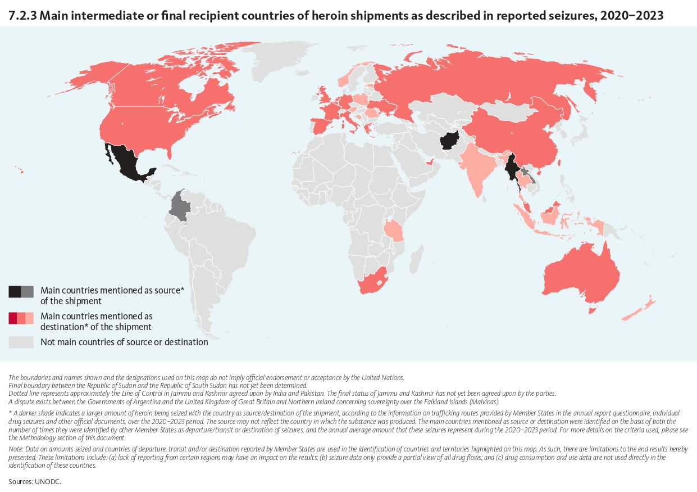
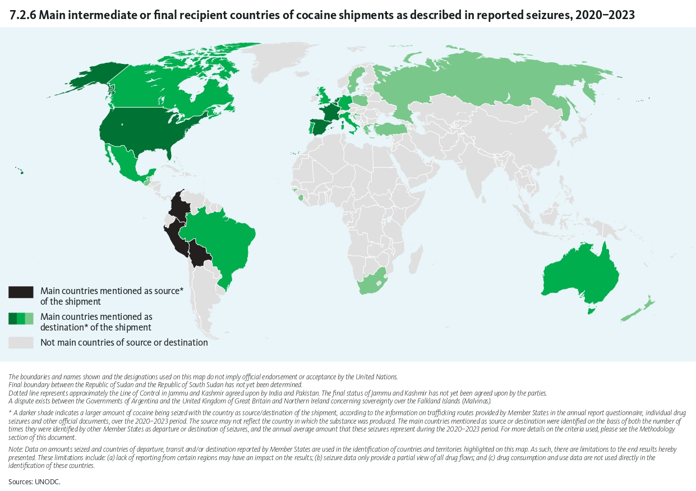
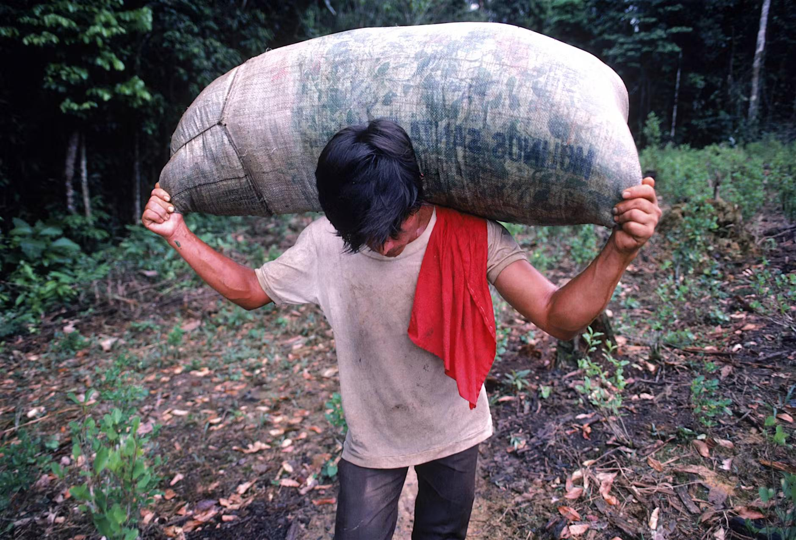

# Der Westen im Dauerrausch?

*Michelle Nikolas*

Ein Kaffee am Morgen, eine Zigarette in der Mittagspause, ein entspanntes Feierabendbier oder ein „Feierabendjoint“ zur Abwechslung, eine „Line“-Kokain auf der Party am Wochenende (Abb 3), buntes Ecstasy auf dem Festival (Abb. 2) und ein Urlaub im Ayahuasca-Retreat (Abb. 4). Entspannter, geselliger, erleuchteter, produktiver, effizienter; all das kann und will der Mensch auf Drogen sein. Doch vor allem der Mensch im Westen?!

*Abb. 2: Symbolbild: eine junge Frau mit einer Pille auf der Zunge (LIGHTFIELD STUDIOS / Adobe Stock)*

Dieser Essay geht der Frage nach, inwiefern sich das Verhältnis und der Umgang mit Drogen – vor allem der illegalen Drogen – in verschiedenen Regionen der Welt unterscheiden, mit einem dezidierten Fokus auf die Unterscheidung von Osten und Westen.

Der Konsum von Drogen ist kein rein westliches Phänomen, es ist ein weltweites, das so alt ist wie die Menschheitsgeschichte selbst. Dies zeigen weltweite prähistorische Funde von halluzinogenen Pflanzen, Höhlenmalereien von „Pilzmenschen“ und Alkoholrückstände an Kultstätten wie Göbeklitepe, in der heutigen Türkei. In einer TV-Dokumentation der populärwissenschaftlichen Reihe *Terra X* des öffentlich-rechtlichen Senders ZDF wird die Hypothese aufgestellt, dass der Mensch möglicherweise ohne den Konsum psychoaktiver Substanzen nicht sesshaft geworden wäre. Demnach hätten diese Substanzen es erst ermöglicht, über die unmittelbare eigene Existenz hinauszudenken. Auf dieser Grundlage seien frühe Vorstellungen von Göttern sowie die Entstehung religiöser Glaubenssysteme begünstigt worden (Terra X, 2018).

Die deutschen Autoren und Journalisten Paul-Philipp Hanske und Benedikt Sarreiter stellen in ihrem Buch „Neues von der anderen Seite: Die Wiederentdeckung des Psychedelischen“ die verschiedenen Beweggründe des Verlangens nach einem Rausch anschaulich dar:

„Seit jeher ist der Rausch ein Menschheitsthema. Wir möchten mit verschiedenen Bewusstseinszuständen spielen, unsere Wahrnehmung manipulieren, für einige Momente enthemmt, offener, mutiger, inspirierter, lustiger, stärker, sensibler, erleuchteter oder einfach nur irrationaler sein. Dieser Drang hemmt kein Verbot.“ (Hanske u. Sarreiter, 2015, S. 13)

In der öffentlichen Wahrnehmung von Drogen und deren Konsumierenden existieren zahlreiche Stereotype. es starke stereotypische Unterschiede. Diese reichen von opioidabhängigen Personen in Obdachlosigkeit, über leistungssteigernde Substanzen im Hochleistungssport, zum Kokainkonsum im Finanzmilieu, bis hin zum Klischee des Hippies auf der Suche nach Erleuchtung oder der antriebslosen Jugend, die Cannabis konsumiert.  
Diese Stereotype vereinfachen jedoch die komplexe Realität des Drogenkonsums und tragen zur gesellschaftlichen Stigmatisierung bei.

Um die geografischen Unterschiede in Konsum und Umgang mit Drogen zu verstehen, müssen man die Entstehungs- und Entwicklungsgeschichte des auf organisiertem Verbrechen basierenden Drogenhandels verstehen. Denn es überschneiden sich heutige Ballungszentren des Konsums bestimmter Drogen mit deren geografischen Ursprungs.  
Das organisierte Verbrechen beginnt in der Zeit, in der die ersten flächendeckenden Drogenverbote ausgesprochen wurden. Diese dienten als Versuch das ein sittliches Zusammenleben aufrechtzuerhalten und gleichzeitig die Macht der Elite gegenüber marginalisierten Gruppen zu demonstrieren.

Eines der frühsten flächendeckenden Rauschmittelverboten trat 1729 in China in Kraft, in Folge auf die weitverbreitete Opium-Abhängigkeit des Bürgertums im 18. Jahrhundert. Den dies erkannte die entspannende Wirkung von Schlafmohn und schaffte sich eine Infrastruktur an „Opium-Höhlen“ rein für den Konsum des Opiums. Die Abhängigkeit der Opium-Konsumenten nutzen britische Händler wie die East India Company aus, um das britische Handelsdefizit mit China auszugleichen. Die Briten importierten nämlich Unmengen an Gewürzen, Tee und Porzellan zu utopischen Preisen aus China. Aufgrund des starken Binnenmarktes Chinas hatten sie dort keinen Abnahmemarkt jeglicher Güter. Mit dem Opium hatten sie nun ein vielversprechendes Gut, welches sie nach China importieren konnten. In ihrer indischen Kolonie stellten sie in großem Maßstabe das reinste Opium der Zeit her, welches über die Häfen wie den in Kanton in die Opium-Höhlen in ganz China gelangte. Da britische Händler trotz Verbote der chinesischen Regierung weiterhin Opium ins Land brachen, erklärte China der englischen Krone den Kriege, da Resultat waren die zwei Opiumkriege von 1839 bis 1842 sowie von 1858 bis 1860. Diese endeten mit viel Zerstörung und forderten zahlreiche Menschenleben. (Bundeszentrale für Politische, 2024) In der Folge gewannen Drogenkartelle und das organisierte Verbrechen zunehmend an Einfluss und festigten ihre Macht über Jahrzehnte hinweg. (ARTE, 2020)

Währenddessen wüteten in den europäischen Industriezentren zahlreiche Epidemien, gegen deren Erreger es noch keine wirksamen Medikamente gab. Diese Situation trieb die Forschung in Medizin und Chemie erheblich voran und begünstigte die Entstehung der ersten Pharmaunternehmen. Zu den bedeutendsten gehörte das deutsche Unternehmen Merck, das unter anderem durch die industrielle Herstellung von Morphin an Bedeutung gewann. Morphin konnte die Epidemien zwar nicht bekämpfen, stellte jedoch einen Meilenstein in der Schmerztherapie dar und veränderte die medizinische Behandlung von Schmerzen nachhaltig.  
In derselben Zeit wurden zudem erstmals Substanzen wie Heroin, Kokain und später auch LSD synthetisiert. Um 1900 fanden diese vermeintlichen Heilmittel Eingang in zahlreiche Salben, Tinkturen, Säfte und andere Arzneimittel, denen vielfältige therapeutische Wirkungen zugeschrieben wurden. Morphin und Heroin wurden beispielsweise zur Behandlung von emotionalen Verstimmungen und Hysterie eingesetzt, insbesondere bei bürgerlichen Frauen. Heroin war darüber hinaus als Bestandteil von Hustensäften erhältlich.  
Als sich zeigte, dass Morphin ein erhebliches körperliches Abhängigkeitspotenzial besaß, versuchte man, Morphinabhängigkeit mit Kokain zu behandeln – zu einer Zeit, als dessen eigenes Suchtpotenzial noch weitgehend unbekannt war. (Arte, 2020)  
Die weitverbreitete medizinische Verschreibung und Vermarktung stark suchterzeugender Substanzen verdeutlicht, wie eng medizinischer Fortschritt und die Entstehung neuer Konsummuster miteinander verknüpft waren. Sie kann als ein früher Baustein jener Entwicklung verstanden werden, die das gesellschaftliche Verhältnis zu psychoaktiven und opiumhaltigen Substanzen sowohl in Europa als auch in den USA nachhaltig prägte.

Parallel dazu schlug sich LSD wacker in der jungen Psychoanalyse des frühen 20. Jahrhunderts. Bis Ende der 1960er Jahre forschten vor allem US-amerikanische Psychotherapeuten mit LSD. Diese hatten die Heilung von Traumata im Sinn und nutzten LSD als Ergänzung zur klassischen Psychotherapie nach Freud. Heute erleben Psychedelika eine Renaissance in den Behandlungszimmer der Psychotherapie als auch in der Palliativmedizin. (Deutsche Welle, 2024)

Nicht nur Psychotherapeut&#42;innen und Mediziner&#42;innen experimentierten mit besagten Drogen Anfang bis Mitte des 20. Jahrhunderts, auch Geheimdienste waren an Psychedelika interessiert. Diese erhofften sich ein Wahrheitsserum oder eine Knockout-Waffe als Vorteil im Wettrüsten. Der US-amerikanische CIA führte dutzende Experimente mit häufig unwissenden Versuchspersonen in unzumutbaren Zuständen durch. Diese Experimente endeten ohne Erfolg für die CIA und teilweise traumatischen Erfahrungen der Proband&#42;innen, da sich keine der psychedelischen Drogen als würdige Waffe erwies. Daraufhin versuchte man, die unzähligen Drogenversuche an Mensch und Tier unter den Teppich zu kehren, um sich wegen jener menschenrechtsverletzenden Versuche nicht rechtfertigen zu müssen (Hanske und Sarreiter, S. 37 ff.).

Man sieht hieran, wie schmal der Grad zwischen medizinischem und missbräuchlichem Einsatz von Drogen ist. Einige Heilkräuter wie Klatschmohn oder Mutterkorn werden seit Hunderten von Jahren zur Linderung von Schmerzen oder emotionalen Verstimmungen eingesetzt. Falsch dosiert wirken sie hingegen berauschend oder sogar tödlich.

Die oben erwähnten Experimente des US-amerikanischen Geheimdienstes endeten nicht nur ohne Erfolg, man könnte sogar sagen, dass sie mitverantwortlich waren für die politische Gegenbewegung der 60-er Jahre. Denn erst durch die LSD-Experimente mit Studierenden in Krankenhäusern kamen jene jungen Menschen in Kontakt mit diesen Droge. Einer der Probanden – Ken Kessey – war der Überzeugung, dass „dieses Zeug“ nicht in den CIA-Laboren bleiben dürfe. Er klaute aus dem Medizinschränkchen große Mengen der Substanzen, mit denen er eine Gruppe an Freunden lange versorgte. Psychedelika waren nun auf dem freien Markt. Kessey gründete mit seinen Freunden die erste Gruppe, die man zur Hippie-Bewegung zählt - „The Merry Pranksters“. Im Zuge des Vietnamkrieges schlossen sich immer mehr unzufriedene Jugendliche ihnen an beziehungsweise suchten ebenso nach Bewusstseinserweiterung und Frieden. Woraus die bekannte 68-er-Bewegung mit freier Liebe und offenem Drogenkonsum von Psychedelika, Cannabis und später auch Heroin entstand. (Hanke u. Sarreiter, 2015, S.15)

*Abb. 1: Man rolling marijuana joints at the Hog Farm Commune in New Mexico, 1968 (Foto: Lisa Law)*

Da bereits die erste Gruppierung als Reisegruppe begann, folgten weitere auf der Suche nach Freiheit und Erleuchtung. Es folgten Gruppen, die sich auf Reisen nach Indien oder Lateinamerika begaben, um durch Meditation, Naturnähe und drogeninduzierte mystische Erfahrungen Erleuchtung und Freiheit zu finden. Auch heutige „Psychonauten“ reisen noch immer in die selben Regionen, diese wurden mittlerweile jedoch stark kommerzialisiert und dienen beispielsweise als Luxus-Wellness-Retreats mit Ayahuasca-Zeremonien zur Selbstoptimierung. Vor rund 10 Jahren fand der Ayahuasca-Tourismus Einzug in Mode-, Beauty-, Kunst- und Stil-Sektionen der Medien wie der New York Times oder der amerikanischen Elle. Die Autoren Hanske und Sarreiter sprechen bei diesem Phänomen von einer neuen Sparte der Selbstfindung, die sich neben Yoga und Schminktipps einordnet. Sie nennen dies: „Hardcore-Wellness“. Sie beschreiben es als „Psychoanalyse auf Höchstgeschwindigkeit“, rasantem „mental healing“, welches dem knappen Zeitkorsett der Bewohner des westlichen Kulturkreises entgegenkomme. Drogentourismus als Lifestyle. (Hanske u. Sarreiter, S. 138f)

*Abb. 4: Website eines Luxus-Ayahuasca-Retreats (ayahuascaretreat.co)*

Bislang ist Drogentourismus vor allem zur Selbstoptimierung ein primär westlich geprägtes Phänomen. In den meisten Fällen ist die Sprache von Tourist&#42;innen der westlichen Welt, die Zielorte sind jedoch verschiedene, bevorzugt in Ländern mit intensiv erlebbarer Natur wie Regenwäldern, doch auch westliche gelesenen Länder mit lockerer Drogenpolitik bieten solche Resorts an. Drogentourismus kann als Ausdruck einer westlichen Sinnsuche gelesen werden, in der nicht-westliche Räume als Orte von Authentizität und Heilung konstruiert werden. Egal welchen Hotspot für Drogentourismus man anguckt, geht dort die Kriminalität hoch durch Sexarbeit, organisierten Drogenhandel, gewaltsame Machtkämpfe krimineller Strukturen und Geldwäsche. Der Handel mit Drogen ist selten ein sauberes Geschäft. (Bötsch, 18.07.2024)

Aus der 68-er-Bewegung folgte nicht nur eine politische Bewegung und verbreiteter Drogentourismus sondern auch auch ein innerpolitische Kriegserklärung. US-Präsident Richard Nixon rief 1971 den „war on drugs“ aus und rief damit eine der größten internen Machtdemonstrationen westlicher Machthaber im Zusammenhang mit Drogen ins Leben. Dieser begründete sich auf den steigenden Gewaltdelikten durch Drogenkartelle als auch der großen Welle an AIDS-Infizierter, die durch den nicht sterilen Heroinkonsum und ungeschützten Sex der Studenten-Bewegung wuchs. Unter Präsident Ronald Reagan wurde aus der Kriegserklärung Ernst, da unter ihm im Jahr 1981 die gesetzliche Grundlage des Einsatzes der Armee im Kampf gegen den illegalen Drogenhandel geschaffen wurde. Es resultierte eine ganz neue Stufe des organisierten Verbrechens und Drogenhandels. Denn wie ganz am Anfang erwähnt, dämmen die Verbote selbst Wunsch nach einem Rauschzustand nicht ein, sie verlagern nur den Markt. (Hanke u. Sarreiter, 2015, S.15 und 65f.) Man könne Nixons Kampagne auch als stark rassistische Propaganda gegen hispanische und afroamerikanische Bevölkerung und Diskreditierung politischer Gegner wie der Hippie-Bewegung lesen, welche stereotypisch Hauptkonsumenten von Drogen wie Cannabis und Psychedelika waren, da die Kampagne Gewalt gegenüber marginalisierten Gruppen instrumentalisierte statt jenen Hilfsangebote zu bieten.

Diese Machtdemonstration der US-amerikanischen Regierung beschränkte sich nicht nur auf die Innenpolitik, sondern dehnte sich auch geopolitisch aus. Sie wütete über Regionen Lateinamerikas und über den Nahen Osten bis nach Südostasien. Nach 09/11 rief man den „war on terror“ aus, woraufhin US-amerikanische Truppen in Afghanistan die „Befriedung“ und „Demokratisierung“ versuchten. Im gleichen Zuge versuchte man ebenso, den Drogenmarkt einzudämmen, da zu dem Zeitpunkt in Afghanistan die größte weltweite Anbau an Schlafmohn (für 80% des weltweiten Heroin und Opium) stattfand. Diese Interventionen blieben jedoch mit wenig Erfolg, die Opium-Produktion in Afghanistan blieb bis zur Machtübernahme der Taliban 2022 stabil. (Lessmann, 2020, S. 205) Ebenso sieht man, wie das Problem des Drogenhandels instrumentalisiert wurde, um geopolitischen Interessen nachzugehen. Beispielsweise wurden geltenden Gesetze umgangen, um wiederholter Bombardements der US-Navy auf private Schiffe entlang der venezolanischen Küste unter dem Vorwand der Eindämmung des Drogenhandels zu legitimierten. Man kann sagen, dass der „War on Drugs“ eine „failed public policy“ ist, da die Menge der zirkulierenden Drogen unverändert, wenn nicht gestiegen sind. Stattdessen hinterließen jegliche Eingriffe nur gewaltsame Übergriffe und anhaltende Machtasymmetrie. (Wolfesberger, 2026, S. 6 ff.)

Wie bereits zuvor erwähnt, liegt das natürliche Vorkommen von Schlafmohn in Zentral- und Südost-Asien. Lange Zeit hatte Khun Sa, erst ein Warlord, daraufhin ein Drogenbaron aus Birma (heute: Myanmar), die Hoheit über jegliches Opium, welches nach den Opiumkriegen in Zentralasien im Umlauf war. Nach seinem Sturz verlagerte sich das Zentrum nach Afghanistan, welches die umliegenden Regionen bis nach Zentralasien und Westafrika mit bis zu 80 % des weltweiten Opium-Bedarfes versorgte. (ARTE, 2020) Erst nach der Übernahme der Taliban 2022 wurden jegliche Felder verbrannt und Opium-Bauern unter Höchststrafe gestellt. Dies hatte immense finanzielle Einbußen für Bauern des ganzen Landes zur Folge. Daraufhin etablierte sich Myanmar erneut als Hauptexporteur von Schlafmohn. (Die Presse, 2023) Aus der bereits erwähnten rund 200 Jahre alten Historie mit Opium in Zentralasien und dem natürlichen Vorkommen des Schlafmohns zeichnete sich bis heute ein starkes Konsumverhalten in Bezug auf Opioide in jenen Regionen ab.

Auf die Abnahme des verfügbaren Schlafmohns in 2022 wuchs der Markt für synthetische Drogen auch in diesen Bereichen des Globus rasant, da man für diese nur kleine Labore und Chemikalien benötigt, welche nicht von klimatischen Bedingungen abhängig sind. Der Drug Report 2025 des UNODC zeigt deutlich, dass Opiate wie Heroin, die Drogen sind, die auch in Zentral-/Südost-Asien einen erheblichen Anteil ausmachen, anders als bei Cannabis/Cannabinoiden, Kokain und synthetischen Drogen (diese finden erst langsam Einzug in diese Region). (UNODC, 2025 [^1]) (s. Abb. 5 und 6 )

*Abb. 5: Main intermediate or final recipient countries of heroin shipments as described in reported seizures, 2020–2023 (UNODC World Drug Report 2025)*

*Abb. 6: Main intermediate or final recipient countries of cocaine shipments as described in reported seizures, 2020–2023 (UNODC World Drug Report 2025)*

Die Verbreitung von Cannabis und Kokain in westlichen Ländern ist unter anderem auf das natürliche Vorkommen von Cannabis- und Kokapflanzen in Mittel- bis Südamerika zurückzuführen. Bereits im 17. Jahrhundert nutzten europäischen Kolonialherren dies aus. Es entwickelten sich festgefahrene Handelsbeziehungen, die sich bis heute heute halten. Vor allem im letzten Jahrhundert nahm die Intensität und Gewaltbereitschaft der beteiligten Akteure des illegalen Drogenhandels zu, befeuert durch den „war on drugs“. Es bildeten sich skrupellose Kartelle heraus, welche die gesamte mediale Wahrnehmung der Bevölkerung Kolumbiens, Mexikos oder Sizilien veränderte und Stereotypen beispielsweise der italienischen Mafioso-Familie mit sich brachte. (ARTE, 2020)

Laut des Drug Report des United Nations Office on Drugs and Crime der letzten Jahre landet ein Großteil jeglicher Drogen, vor allem Kokain und synthetische Drogen, in westlichen Ländern, während lateinamerikanische Länder wie Venezuela, Mexiko und Kolumbien für Kokain und Cannabis Hauptexporteur sind. Dies bestätigt auch eine Statistik von Conor Stewart zur „Prävalenz von injiziertem Drogenkonsum nach Weltregion 2022“.

*„Die Statistik zeigt die Prävalenz von injiziertem Drogenkonsum nach Weltregion im Jahr 2022. In diesem Jahr betrug die Prävalenz von injiziertem Drogenkonsum in Nord- und Südamerika unter den 15- bis 64-Jährigen rund 0,65 Prozent.“* (Stewart, 2026)[^2]

Ein weiterer Bericht aus dem der hohe Konsum an Kokain und synthetischen Drogen im Westen hervor ist der neue Abwasserbericht der EUDA für 2025. Aus diesem geht hervor, dass Kokain, Ketamin, Ecstasy und MDMA flächendeckend in Europa konsumiert werden. Stark erhöhtes Aufkommen findet man vor allem in den Ländern rund um die zentralen Umschlaghäfen Europas wie Rotterdam, Antwerpen und Hamburg, über welche das Kokain aus Lateinamerika nach Europa gelangt. Auch Party-Hotspot-Städte wie Berlin, Lissabon und Frankfurt stehen weit oben im Ranking. (EUDA, 2026)

Alle diese Werte verstärken die Stereotypen über die koksende Leistungsgesellschaft des Westen, als auch das des hedonistischen Party-Lifestyle als Ausgleich gegenüber dem Leistungsdruck. In einem Podcast des NDR wird von einer „Kokain-Welle“ in Europa gesprochen. In ihrem Podcast „Organisiertes Verbrechen – Recherchen im Verborgenen“ kommen Expert&#42;innen aus dem Bereich Kriminologie, Politik und Soziologie zum Thema Organisiertes Verbrechen in diesem Fall mit Fokus auf Kokain zu Wort. Kokain sei schon lange nicht mehr eine Droge ausschließlich des stereotypisch westlichen Finanzmilieus und Unternehmertums, wie es in Filmen dargestellt werde. Kokain sei schon längst tief in der Gesellschaft angekommen. Filme wie „The Wolf of Wall Street“, die Wallstreet-Aktionäre-Leben voll Drogenkonsum und Sexsucht (The Wolf of Wallstreet, 2013 (vgl. Abb. 5)) darstellen, seien schon längst überholt, da dies nur den Anfang der aktuellen Kokain-Welle bildete (NDR, 2021).

Kokain tonnenweise in Europa im Umlauf. 2023 meldeten die EU-Mitgliedsstaaten, dass sie in jenem Jahr insgesamt 419 Tonnen Kokain in den Häfen Europas beschlagnahmten (EUDA, 2025), man schätzt das Gesamtvolumen an Kokain im Umlauf auf mindestens das 10-fache. (NDR, 2021) Laut einem Post von FUNK soll 1 von 30 jungen Personen (18–25 Jahre) in Deutschland in den letzten 12 Monaten mindestens einmal Koks konsumiert haben (Funk, 21.03.2026). Bei diesem Ausmaß an Konsum kann man nicht mehr nur von einem Stereotyp einer bestimmten Gesellschaftsschicht des Westens sprechen, sondern man muss anerkennen, dass dies die Realität vieler Menschen aller Gesellschaftsschichten ist. Es sind nicht nur Wallstreet-Aktionäre und Architekten, es sind Lkw-Fahrer&#42;innen, Kassierer&#42;innen, Postboten, Partymäuse, überarbeitete Arbeitnehmer&#42;innen, Alleinerziehende,… . Mit Kokain ist nun eine weitere Droge in das Arsenal an Gesellschaftsdrogen im Westen neben Alkohol, Nikotin und Koffein eingezogen.

Das stetige Wachstum an Kokain in Europa wird zudem dadurch gefördert, dass Koka-Händler in Kolumbien aufgrund der höheren Verkaufspreise in Europa bevorzugt nach Europa als in die USA verkaufen. (NDR, 2021) Eine ebenso interessante Entwicklung des Marktes ist der sich erhöhende Reinheitsgrad (2023 um 34 % höher als 2013) und der gleichzeitig stabil bleibende Endverbraucherpreis pro Gramm Kokain (EUDA, 2025). Die großen Abnahmemengen an Kokain könnten Grund für einen effizienteren Ausbau der Koka-Plantagen und der Infrastruktur des Transport sein, wodurch die Produktionspreise sinken. Die Einfuhr von großen Mengen an Kokain hat nicht nur Auswirkungen auf persönlicher Ebene für die Konsumenten sondern auch für die Demokratie des Land. Bart De Wever, der Bürgermeister Antwerpens, spricht von eben dieser Gefahr für die Demokratie, erweist auf die bereits weit verbreiteten Bestechung der Behörden, Immobilienmaklern, etc. durch die Kartelle in der Hafenregion hin. Er warnt vor einer unsichtbaren Unterwanderung der Demokratie durch den Drogenmarkt. (NDR, 2021)

Bis dato lag der Fokus der Arbeit auf den Folgen des Drogenkonsums weltweit, um auch auf die Folgen des Individuums hinzu weisen, soll hier exemplarisch auf die Netflix-Dokumentation „Babo – Die Haftbefehl Story“ über den deutschsprachigen Rapper „Haftbefehl“ aus dem letzten Jahr verwiesen werden. Diese zeigt ungeschönt und hautnah die Realität eines kokainabhängigen Stars mit körperlichen und emotionalen Zusammenbrüchen, der mit verätzten Schleimhäuten und einem tief zerrütteten sozialen Umfeld zu kämpfen hat. (Netflix, 2025)

*Abb. 8: Ein kolumbianischer Bauer transportiert einen Sack Koka-Blätter (Foto: Jose Azel, Berliner Zeitung)*

Die Folgen der Kokain-Produktion in den Herkunftsländer sind häufig tiefgreifender, struktureller und überlebensentscheidender als für jene konsumierende Individuen im Westen. In vielen Regionen Lateinamerikas führt die Einbindung in die Drogenökonomie zu einer wirtschaftlichen Abhängigkeit: In einer Fallstudie ländlicher Gebiete Mexikos wird beschrieben, dass sich über Jahrzehnte ein „ökonomisch geprägter Habitus“ entwickelte, bei dem Entscheidungen zunehmend an den Möglichkeiten des Drogenmarktes ausgerichtet wurden. Das bedeutet, dass traditionelle Landwirtschaft oder andere Einkommensquellen verdrängt wurden und ganze Dorfgemeinschaften vom illegalen Anbau abhängig wurden. Gleichzeitig brachte diese Ökonomie massive Gewalt mit sich.  
Beispielweise eskalierte die Gewalt in Ciudad Juárez im Zuge der militarisierten Drogenbekämpfung extrem: Allein im Jahr 2010 seien dort über 3.500 Menschen ermordet worden, viele davon junge Männer aus marginalisierten Vierteln, die bis heute unauffindbar sind. Diese Zahlen zeigen, dass die lokale Bevölkerung selbst zum Hauptopfer des Drogenkampfes wird.  
Hinzu komme die systematische Kriminalisierung und Stigmatisierung der Bewohner. Nach Massakern wie in Villas de Salvárcar seien Opfer zunächst pauschal als Teil krimineller Gruppen dargestellt worden, obwohl es sich um unbeteiligte Jugendliche handelte. Dieses Beispiel verdeutlicht, wie schnell ganze Gemeinschaften unter Generalverdacht geraten und sozial ausgegrenzt werden.  
Zusammengefasst zeigt sich: Der Kokain-Anbau führt nicht nur zu wirtschaftlichen Veränderungen, sondern konkret zu Gewaltspiralen, sozialer Stigmatisierung und einer langfristigen wirtschaftlichen Abhängigkeit ganzer Regionen vom illegalen Markt. (Wolfesberger, 2026, S. 27-29, 30-32, 113f.)

Aufgrund der wirtschaftlich prekären Situation könne sich anscheinend die am Drogenanbau beteiligte Bevölkerung den Konsum nicht leisten könne, doch würden dies auch kaum wollen - auf Grund ihres Wissens über die Herstellung. (ARTE, 2020)

Aufgrund der unglaublich geringen Herstellungskosten von knapp 1 Cent pro Gramm und der starken Abhängigkeit wird Fentanyl auch die Droge der Dealer genannt. Diese stecken häufig andere Drogen mit Fentanyl, um ihre Kundschaft abhängiger zu machen. Die Problematik mit der wirklich geringen Dosierung hat schon einigen Menschen und vor allem vielen Jugendlichen das Leben gekostet. Häufig wenn diese unwissend mit Fentanyl gestreckte Drogen konsumierten.  
US-amerikanische Highschools sind in Teilen der USA dazu verpflichtet, Zugang zu Naloxon, einem Opioid-Gegenmittel, zu gewährleisten, um Schüler&#42;innen vor dem Tod an einer Überdosis zu schützen. (LAPPA, 2025) Das Ausmaß der Fentanyl-Krise ließe sich mit der stark verbreitete Opioid-Abhängigkeit in den USA durch verschreibungspflichtige Schmerzmittel mit hohem Opioid-Anteil erklären. Dies trat Protestbewegungen los, die auf die Problematik des Missbrauchs von stark opiumhaltigen Schmerzmitteln hinweisen. Denn wenn sich Patienten nicht mehr die teureren Medikamente leisten konnten, steigen sie aufgrund ihrer Suchterkrankung auf günstigere, ungeprüfte Opiate des Schwarzmarktes um. Dies erhöhe jedoch das Infektionsrisiko sowie das Risiko des Todes durch eine Überdosis immens, wodurch 2023 ca. 76.000 Menschen durch Fentanyl ums Leben kamen. Diese Todeswelle rief auch einiger Proteste (vgl. Abb.6) ins Leben, die auf die Problematik der relativ leicht zugänglichen Opioid-haltigen Schmerzmitteln in den USA hinweisen. (Schneider, 04.03.2026)

*Abb. 9: Angehörige und Opfer der Opioid-Epidemie vor dem Bundesgericht in Cleveland, Ohio, Mai 2018 (Foto: Lorenz Rollhäuser / Deutschlandradio)*

Der Anstieg an synthetischen Drogen in den westlichen Staaten bringt nicht nur Krisen für die Staaten selbst mit sich. Ebenso zeigt sich durch den weltweit drastischen Anstieg des Drogenkonsum in den letzten Jahren, dass auch der Konsum entlang der globalen Lieferketten zu nimmt, die bis dato noch keinen etablierten Abnahmemarkt hatten. Gerade aus dem letzten Drug Report der UNODC von 2025 geht hervor, dass gerade auch in Zentralasien, Westasien und Nordafrika, neben Opiaten nun auch synthetische Droge Einzug finden. Mögliche Erklärungen sind die einfache Verfügbarkeit der Rohstoffe, die geringeren Herstellungskosten und Herrstellungmöglichkeiten in kleinen Laboren.

Während der Corona-Pandemie stieg die Zahl der Drogenkonsumenten in großem Maßstab in Zentralasien vor allem der von synthetischen, günstigen Drogen wie New Psychedelic Substances (NPS). Zwischen 2009 und 2021 hat man allein 1087 verschiedene NPS nachweisen können. Man geht von aus, dass pro Woche eine neue Substanz hinzu kommt. Dies könnte damit erklärt werden, dass die flächendeckende Infrastruktur der Herstellung von COVID-Impfstoffe nach der Corona-Pandemie Zweck entfremdet wurden und Labore für neue (illegale) Substanzen eröffneten.

Der leichte Zugang zu psychoaktiven, günstigen Substanzen hat drastische Auswirkung auf Länder, die bis dato noch kein Konzept für den Umgang mit Drogenmissbrauch hatten. Denn diese können keine ausreichende gesundheitliche Versorgung gewährleisten, die mit der steigenden Anzahl an Suchtpatienten und Aids-Kranker umgehen könnte. Betroffen Staaten Zentralasiens sind abhängig von externen NGOs mit qualifizierten Expert&#42;innen, die bereit sind, ihre Kapazität und Know-How in die Bevölkerung der Regionen zu stecken. Von staatlicher Seite gibt es häufig kaum bis keine ausreichende Versorgung. (Mariya Prilutskaya, 2025, S. 145).

Aus einem neuen Buch „Invisible and Ignored“ zum Drogenkonsum bei Frauen in Zentralasien geht hervor, dass es einen starken Unterschied in der sozialen Arbeiten mit Suchterkrankung und Drogentoten im Westen und Zentralasien gebe. In Zentralasien sei das Arbeitsfeld der sozialen Arbeit ein ganz neues, welches erst Stück für Stück aufgebaut werden muss, während es durch den mittlerweile schon knapp 50 Jahre langen „War on Drugs“ und die knapp 150‑jährigen existierenden psychiatrischen Einrichtungen ein etabliertes Feld im Westen geworden sei.

In Zentralasien herrsche vor allem gegenüber Frauen immer stark konservativ geprägte Rollenbilder, die der fürsorglichen Mutter, die Erfüllung in Haushalt, Kindererziehung und sexueller Befriedigung des Mannes findet. Diese Rollenbild lässt kein Raum für Toleranz oder gar Akzeptanz für den Konsum von Drogen zu, erst recht nicht für exzessiven Konsum. Aufgrund dessen leide man als Frau dort noch immer an finanzieller Abhängigkeit, häuslicher Gewalt und Stigmatisierung. Wenn man als Frau in jenen Regionen mit einer Suchterkrankung zu kämpfen habe, werde man sich sexistischer Stigmatisierung in der medizinischen Versorgung und erhöhter häuslicher Gewalt ausgesetzt, da Drogen-Abhängigkeit und HIIV-Infektionen stark mit verpönter Sexarbeit in Verbindung gebracht werden wurden. Nur in Frauenhäusern externen Sponsoren wurden drogenabhängige Frauen ausreichende medizinische Versorgung und sichere Räumlichkeiten zu Verfügung gestellt bekommen. (Kowalczyk, Steimle und Grabski, 2025, S. 16)

Insgesamt zeigt sich, dass Drogenkonsum ein globales Phänomen ist, das in unterschiedlichen Regionen verschieden ausgeprägt ist. Während westliche Länder vor allem als Hauptkonsummärkte gelten, sind viele lateinamerikanische und südostasiatische Regionen die zentralen Produktionszentren. Diese unterschiedlichen Ausmaße haben verschiedene Risiken und Umgangsweisen hervorgebracht. Sie haben teils zu unterschiedlicher Kriminalisierung geführt, was wiederum spezifische Herausforderungen für die betroffenen Länder und ihre Strategien im Umgang mit Drogen mit sich bringt. Es wird häufig übersehen, dass der Fokus westlicher Konsumenten auf dem individuellen Konsum, der sich auf Freude, Bewusstseinserweiterung und persönliche Erfahrung richtet, die realen Risiken und Folgen in den Produktionsregionen verschleiert. So bleibt häufig unerkannt, wie stark diese globalen Ungleichgewichte das Leid vor Ort und die kriminellen Strukturen prägen, die letztlich den Frieden und die Demokratie aller gefährden. Kriminologen warnen vor einer durch Kartellbewegungen gefährdeten Demokratie, auch hier in Europa, nicht nur in bereits untermauerten Narco-Staaten[^3]. (NDR, 2020)

## Quellenverzeichnis

ARTE. (2020). Der große Rausch (1/3) - Das Zeitalter der Imperien - Die ganze Doku | ARTE [https://www.arte.tv/de/videos/078196-000-A/der-grosse-rausch-1-3/](https://www.arte.tv/de/videos/078196-000-A/der-grosse-rausch-1-3/) (Stand: 25.04.2026)

Bundeszentrale für Politische. (2024, 22. Oktober). Das Jahrhundert der Demütigung | China | bpb.de. [https://www.bpb.de/themen/asien/china/552198/das-jahrhundert-der-demuetigung/](https://www.bpb.de/themen/asien/china/552198/das-jahrhundert-der-demuetigung/) (Stand: 25.04.2026)

Bötsch, Stefanie, Psychoaktiv. (2024, 18. Juli). 94. Koks in Cali, Shrooms auf Bali - Drogentourismus & Safer Use [Video]. YouTube. [https://www.youtube.com/watch?v=u4K40a7ElSE](https://www.youtube.com/watch?v=u4K40a7ElSE) (Stand: 25.04.2026)

Deutschlandfunk Kultur. (2015). Drogen während der Nazizeit - Mit Amphetaminen in den Blitzkrieg. [https://www.deutschlandfunkkultur.de/drogen-waehrend-der-nazizeit-mit-amphetaminen-in-den-100.html](https://www.deutschlandfunkkultur.de/drogen-waehrend-der-nazizeit-mit-amphetaminen-in-den-100.html)

Die Presse. (2023, 13. Dezember). Warum nun Myanmar - und nicht Afghanistan - der weltgrößte Opium-Produzent ist. Die Presse. [https://www.diepresse.com/17913662/warum-nun-myanmar-und-nicht-afghanistan-der-weltgroesste-opium-produzent-ist](https://www.diepresse.com/17913662/warum-nun-myanmar-und-nicht-afghanistan-der-weltgroesste-opium-produzent-ist) (Stand: 20.05.2026)

EUDA. (2026). Wastewater analysis and Drugs — a European multi-city study. In European Union Drug Agency. [https://www.euda.europa.eu/publications/pods/waste-water-analysis_en](https://www.euda.europa.eu/publications/pods/waste-water-analysis_en)

Gürtler, L. (2022, 15. Dezember). Die Kokain-Welle: Wie eine Droge Europa flutet (1/3). ndr.de. [https://www.ndr.de/nachrichten/info/Organisierte-Kriminalitaet-Folge-1-Wie-eine-Droge-Europa-flutet,audio912948.html](https://www.ndr.de/nachrichten/info/Organisierte-Kriminalitaet-Folge-1-Wie-eine-Droge-Europa-flutet,audio912948.html) (Stand: 25.04.2026)

Hanske, P. & Sarreiter, B. (2015). Neues von der anderen Seite: Die Wiederentdeckung des Psychedelischen. Suhrkamp, Berlin.

Hayes, A. (2025). The Counterculture Hippie Movement of the 1960s and 1970s | TheCollector. TheCollector. [https://www.thecollector.com/hippie-counterculture-movement-1960s-1970s/](https://www.thecollector.com/hippie-counterculture-movement-1960s-1970s/) (Stand: 22.06.206)

Kan, P. R. (2016). *Drug trafficking and international security*. Rowman & Littlefield Education [2016], Plymoth,UK.

Kowalczyk, K. K., Steimle, L. & Grabski, M. (2025). Invisible and Ignored. In Nomos Verlagsgesellschaft mbH & Co. KG eBooks. [https://doi.org/10.5771/9783748943211](https://doi.org/10.5771/9783748943211)

LAPPA. (2026, 30. März). Naloxone in high schools. [https://legislativeanalysis.org/knowledge-lab-state-maps/naloxone-in-high-schools/](https://legislativeanalysis.org/knowledge-lab-state-maps/naloxone-in-high-schools/) (Stand: 25.04.2026)

Lessmann, R. (2020). Internationale Drogenpolitik: „Vom Zwang zum Zusammenhalt“. Abschied vom Drogenkrieg? Zeitschrift für Außen- und Sicherheitspolitik, 13(2), 197–213. [https://doi.org/10.1007/s12399-020-00810-z](https://doi.org/10.1007/s12399-020-00810-z) (Stand: 25.04.2026)

Netflix. (2025). Babo: The Haftbefehl Story | Netflix Official site. [https://www.netflix.com/de/title/81687374](https://www.netflix.com/de/title/81687374) (Stand: 25.04.2026)

Peltner, A. (2025, 30. August). Fentanylkrise in den USA: Hundertmal stärker als Morphium. taz.de. [https://taz.de/Fentanylkrise-in-den-USA/!6107488/](https://taz.de/Fentanylkrise-in-den-USA/!6107488/) (Stand: 20.05.2026)

Prilutskaya, M. (2025). New psychoactive substances. In Nomos Verlagsgesellschaft mbH & Co. KG eBooks. [https://doi.org/10.5771/9783748943204](https://doi.org/10.5771/9783748943204)

Schneider, A. (2026, 4. März). Fentanyl-Krise in den USA: Schmerzmittel als Todesfalle. tagesschau.de. [https://www.tagesschau.de/ausland/amerika/usa-fentanyl-krise-100.html](https://www.tagesschau.de/ausland/amerika/usa-fentanyl-krise-100.html) (Stand: 22.06.2026)

Stewart, C. (2026, 3. März). Prävalenz von injiziertem Drogenkonsum nach Weltregion 2022. Statista. [https://de.statista.com/statistik/daten/studie/261817/umfrage/praevalenz-von-injiziertem-drogenkonsum-nach-weltregion/](https://de.statista.com/statistik/daten/studie/261817/umfrage/praevalenz-von-injiziertem-drogenkonsum-nach-weltregion/) (20.06.2026)

TerraX. (2018). Drogen - eine Weltgeschichte (1/2). ZDF. [https://www.zdf.de/play/dokus/terra-x-drogen-eine-weltgeschichte-mit-harald-lesch-100/drogen-eine-weltgeschichte-mit-harald-lesch-teil-eins-100](https://www.zdf.de/play/dokus/terra-x-drogen-eine-weltgeschichte-mit-harald-lesch-100/drogen-eine-weltgeschichte-mit-harald-lesch-teil-eins-100) (Stand: 25.04.2026)

The Vaults of Erowid : Big Chart Index. (o. D.). [https://www.erowid.org/general/big_chart.shtml](https://www.erowid.org/general/big_chart.shtml) (Stand: 25.04.2026)

UNODC. (2026). World Drug Report 2025. United Nations : Office On Drugs And Crime. [https://www.unodc.org/unodc/en/data-and-analysis/world-drug-report-2025-maps.html](https://www.unodc.org/unodc/en/data-and-analysis/world-drug-report-2025-maps.html) (Stand: 25.04.2026)

von Hein, Matthias. (2023, 17. April). 80 Jahre LSD - eine Droge macht Geschichte. dw.com. [https://www.dw.com/de/80-jahre-lsd-die-wechselvolle-geschichte-einer-droge/a-65192134](https://www.dw.com/de/80-jahre-lsd-die-wechselvolle-geschichte-einer-droge/a-65192134) (Stand: 25.04.2026)

Wolfesberger (Ed.), P. (2026.). Drug Assemblages – Policies, Counternarratives, and Local Experiences. Transcript Verlag. [https://www.transcript-verlag.de/978-3-8376-8127-7/drug-assemblages-policies-counternarratives-and-local-experiences/](https://www.transcript-verlag.de/978-3-8376-8127-7/drug-assemblages-policies-counternarratives-and-local-experiences/) (Stand: 20.05.2026)

## Bildquellen (Stand: 22.06.2026)

Abb. 1: Lisa Law & National Museum of American History, Washington DC. (o. D.). Man rolling marijuana joints at the Hog Farm Commune in New Mexico, 1968. [https://www.thecollector.com/hippie-counterculture-movement-1960s-1970s/](https://www.thecollector.com/hippie-counterculture-movement-1960s-1970s/)

Abb. 2: stock.adobe.com/LIGHTFIELD STUDIOS. (2015, 2. Juli). Symbolbild: eine junge Frau mit einer Pille auf der Zunge. [https://www.br.de/nachrichten/bayern/legales-lsd-aus-dem-internet-neue-drogen-aus-deutschland,UpJNEUv](https://www.br.de/nachrichten/bayern/legales-lsd-aus-dem-internet-neue-drogen-aus-deutschland,UpJNEUv)

Abb. 3: Scorsese, M. (Regisseur). (2013). The Wolf of Wallstreet. , 48:38

Abb. 4: Most Exclusive Luxury Ayahuasca Retreats and Ayahuasca Ceremonies. (o. D.). Ayahuasca Retreats. https://www.ayahuascaretreat.co/

Abb. 5: UNODC. (2026). World Drug Report 2025. United Nations : Office On Drugs And Crime. [https://www.unodc.org/documents/data-and-analysis/WDR_2025/maps/08_Main_departure_or_transit_countries_of_heroin_shipments_as_described_in_reported_seizures.pdf](https://www.unodc.org/documents/data-and-analysis/WDR_2025/maps/08_Main_departure_or_transit_countries_of_heroin_shipments_as_described_in_reported_seizures.pdf)

Abb. 6: UNODC. (2026). World Drug Report 2025. United Nations : Office On Drugs And Crime. [https://www.unodc.org/documents/data-and-analysis/WDR_2025/maps/05_Main_departure_or_transit_countries_of_cocaine_shipments_as_described_in_reported_seizures.pdf](https://www.unodc.org/documents/data-and-analysis/WDR_2025/maps/05_Main_departure_or_transit_countries_of_cocaine_shipments_as_described_in_reported_seizures.pdf)

Abb. 7: Scorsese, M. (Regisseur). (2013). The Wolf of Wallstreet. , 2:19:56

Abb. 8: Jose Azel. (2023, 10. August). Ein kolumbianischer Bauer transportiert einen Sack Koka-Blätter. Berliner Zeitung. [https://www.berliner-zeitung.de/article/drogen-rauschgift-kolumbien-das-geschaeft-mit-dem-kokain-und-was-das-fuer-die-bauern-bedeutet-301993](https://www.berliner-zeitung.de/article/drogen-rauschgift-kolumbien-das-geschaeft-mit-dem-kokain-und-was-das-fuer-die-bauern-bedeutet-301993)

Abb. 9: Lorenz Rollhäuser & Deutschlandradio. (o. D.). Vor dem Bundesgericht in Cleveland/Ohio im Mai 2018: Angehörige und Opfer der Opioid-Epidemie fordern Milliarden, um Reha-Zentren zu finanzieren. , 28.08.2018, [https://www.hoerspielundfeature.de/die-opiatkrise-in-den-usa-painkillers-100.html](https://www.hoerspielundfeature.de/die-opiatkrise-in-den-usa-painkillers-100.html)

[^1]: Drug report 2025 ist vorwiegend gemessen an der vom Zoll beschlagnahmten Menge der Substanzen hervor. Die Studien selbst merkt an, dass die Datenlage aus bestimmten Region einen Einfluss auf das Ergebnis haben kann. Man könnte annähmen, dass tendenziell konservative, totalitäre Staaten mit scharfer Drogenpolitik eine offene Berichterstattung über den Drogenkonsum des Landes einschränken bis unterbinden. )

[^2]: In dieser Statistik ging es weder um die genaue Menge noch den bestimmten Wirkstoff der Drogen sonder rein darum, ob Personen mindestens einmal in diesem Jahr Drogen sich mit einer Spritze injiziert haben.

[^3]: „A narco-state exists where the institutions of government direct drug trafficking activities or actively collude with drug traffickers, creating conditions where the ilicit narcotics trade eclipses portions of the country 's legitimate economy and where segments of society begin to accrue benefits from drug trafficking. A narco-state thrives due to its ability to exploit aualities of the state 's links to the legitimate global economy.“ (Kan, 2016, S. 51)
