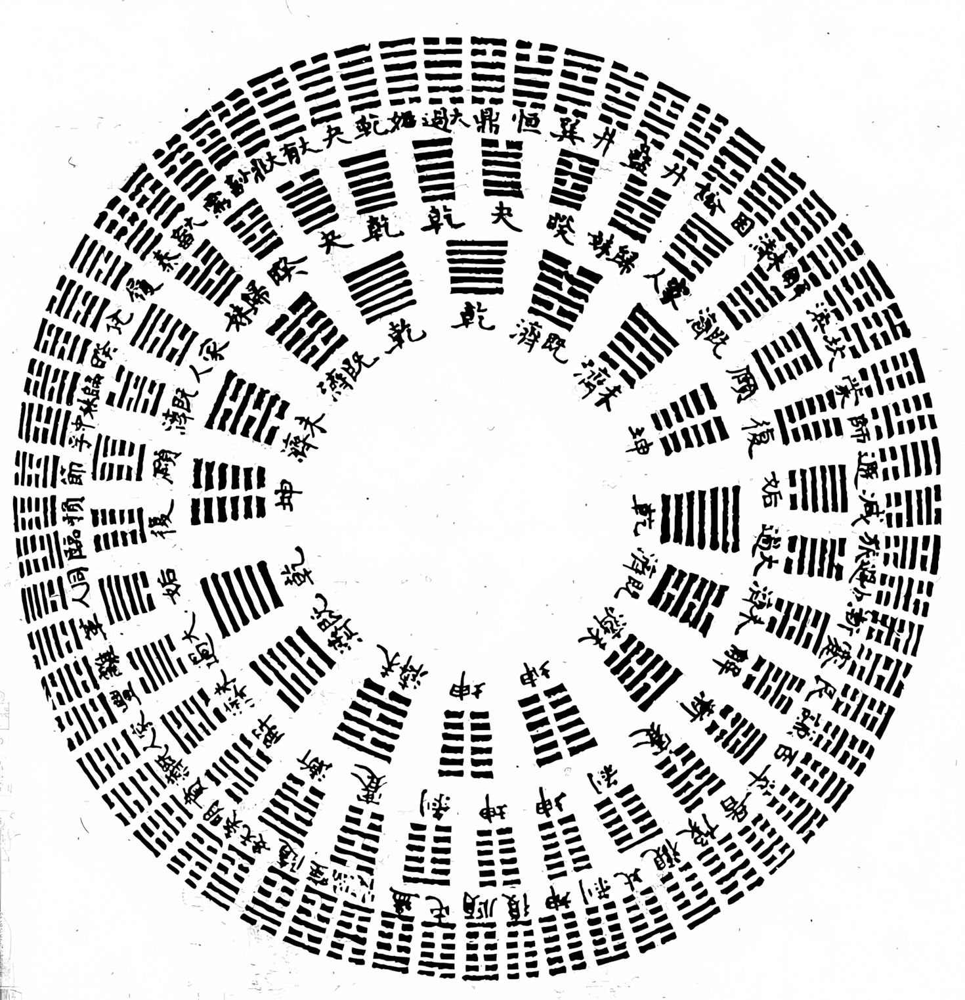
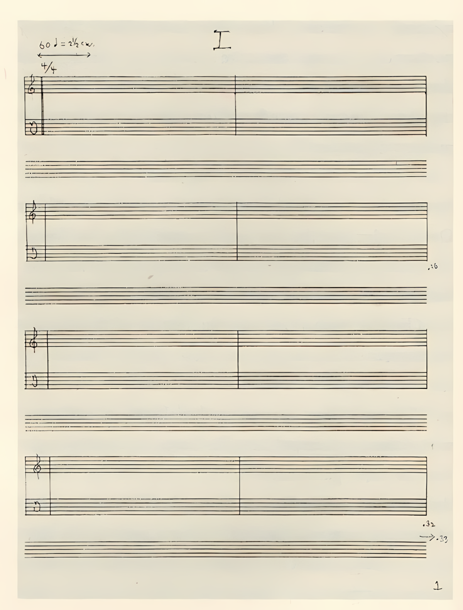

# haha, that's so Random

*Chance, Subjectivity, and the West in the Work of John Cage and Beyond*

*Daniel Louis Lythgoe*

“haha, that’s so random” — this quintessentially millennial phrase seems to have emerged in late 20th-century colloquial English (its first documented use was in an MIT student newspaper in 1971), but gained widespread traction in the 2000s.[^1] Randomness here is a deviation from the status quo, noise in an otherwise ordered signal. It teeters on the edge of indifference and malaise, a shrug toward incoherence, the delight of the unexpected punctuated by an apprehension towards the unknown.

Yet the story of randomness reaches further back than the turn of the millennium. The word *random* entered English after the Norman conquest, derived from the Old French *randon*, denoting speed, haste, impetuous force.[^2] It evoked motion without restraint, a gallop, an unshackled and forceful trajectory. Only in the late nineteenth century did randomness acquire its modern scientific meaning: an event without pattern, governed by probability distributions rather than purpose.

In the vertiginous speed of the computational age, randomness and probability have gained new currency; predictive statistical models are heralded as the spinning jenny of cognitive, creative and, subsequently, all labour. In sifting through seemingly random hallucinations, what can randomness reveal about the unexpected ways it challenges intentionality, irrationality, and determinacy, and about the cultural frameworks that deploy it? In particular, what does it disclose about the shifting idea of “the West” — an unstable category, neither clearly geographical nor reducible to political or economic systems, yet which nevertheless persists as an imaginative and ideological reference point?

This essay approaches these questions through the work of John Cage. His use of chance operations, most famously through the *I Ching*, does not simply introduce randomness into music, but stages a confrontation between different epistemologies, often mapped, however polemically, onto “East” and “West.” In Cage’s work, randomness becomes a method for displacing Western ideals of authorship, intention, and control, while simultaneously relying on often decontextualised “Eastern” resources to do so.

Tracing different meanings of chance, from pre-modern divination to contemporary computation, this essay approaches randomness as a critical probe into Western self-understanding, nowhere more vividly than in Cage’s experimental music.

## Randomness ←→ Intentionality

Across many cultures and periods, randomness has often been viewed with suspicion or discomfort. Chance events are variously attributed to fate, fortune, divine will, or cosmic justice — forces imagined as governing a fickle universe, and approached through divinatory practices such as casting lots, reading entrails, interpreting omens. That sense of danger lingers in language: *hazard* in English derives from games of dice, an origin echoed in the French *par hasard.*[^3]

Randomness, in this pre-modern sense, presents itself as a semantically denuded canvas for the imagination — not an absence of meaning, but a lack of immediate legibility, an invitation to interpretation. The pattern-seeking impulse which reads chance happenings as facets of a concealed order is characteristic of this view of randomness. To blind Fortuna we ascribe that which lies beyond the limits of our understanding, capricious chance serving as an open surface for the projection of meaning. Through its attribution to causality, randomness is largely dismissed as intolerable, rendered intentional by its incorporation into a world-view external to it. And there is truth in this; phenomena unexplained or events unincorporated exist in a semiotic superposition. If something can be anything, then it is as yet nothing, a shadow on reality.

Sometimes, these systems were formalised — one prominent example is in the *I Ching* (Book of Changes), the ancient Chinese divination text. Operating through a system of hexagrams generated by coin tosses or yarrow stalk manipulations, the *I Ching* “served for thousands of years as a philosophical taxonomy of the universe, a guide to an ethical life, a manual for rulers, and an oracle of one’s personal future and the future of the state.”[^4] It gained prominence in the anglosphere following the publication of the Wilhelm/Baynes English translation in 1950 (itself derived from an earlier German translation), transforming the text and its cosmology “from Sinological arcana to international celebrity”,[^5] rendered as a palatable method for artists and counter-culturalists to adopt and flexibly adapt.[^6]

*The 64 Hexagrams of the I Ching, circular arrangement*

It is precisely in this liminal state that it entered the work of John Cage, who saw in the *I Ching* an alternative to, and critique of, the predominant serialist paradigm. In *Music of Changes* (1951), he employed its chance operations not to disavow structure but to suspend personal taste,[^7] seeking methods of composition that displace subjective sensibilities onto systems, performers, or both. While Cage gives examples of using the *I Ching* as an oracular text (in one example he describes consulting it when advising a friend whether to send a sensitive letter)[^8]*,* his description of its application in his composition is largely stripped of its divinatory context, while retaining its procedural logic[^9]. The random procedures and coin-tosses no longer revealed cosmic truth; they generated compositional decisions in terms of pitch, duration, and dynamics, serving as mechanisms to reconfigure the relationship between the composer and the performer.[^10] The former became a facilitator of processes rather than an architect of outcomes.

Authorship is thereby redistributed within a field of interacting agencies: performers, systems, and contingent events. This redistribution extends to sound material itself: all sounds are treated without hierarchy, with no precedence given to harmony over noise. In works such as *Imaginary Landscape No. 4* (1951), composed for twelve radios, the sonic content is shaped by whatever happens to be broadcast at the moment of performance.[^11]

This reconfiguration of compositional authority did not go uncontested. Contemporaries including Pierre Boulez and Luigi Nono disparaged what the latter described as an “ahistorical conception of music”[^12] in Cage’s use of chance-operations.

Cage’s most notorious embrace of randomness can be found in *4'33"* (1952), in which (bar the opening and closing of the keyboard lid) the performer does not intentionally produce sounds at all. The piece frames ambient noise as music, a concerto of coughs, sniffles, shuffling feet, the hum of ventilation like a blanket over a general sense of audience unease.

*Fig. 1: 4’33” Score Excerpt(1952) by John Cage*

Cage was widely ridiculed for *4'33"*. The accusation was not simply that nothing happened, but that nothing *intentional* happened. Yet the point lay precisely in the apparent emptiness of the performance. By withdrawing deliberate sound, he emphasised the contingency of auditory experience. As he would later put it in an interview with William Duckworth:

> "I use it [4’33”] constantly in my life experience. No day goes by without my making use of that piece in my life and in my work. I listen to it every day... I don’t sit down to do it; I turn my attention toward it. I realize that it's going on continuously. So, more and more, my attention... is on it. More than anything else, it's the source of my enjoyment of life."[^13]

Of course, Cage’s forays into chance-based operations did not emerge in a vacuum. The early twentieth century had already witnessed artistic movements that embraced indeterminacy as a strategy which preceded the sheen of Eastern mysticism that characterised the work of Cage and many contemporaries. The Dadaists, for instance, employed chance procedures extensively. Tristan Tzara’s instruction to compose a poem by pulling words at random from a bag is perhaps the most canonical example.[^14] These acts were not naïve celebrations of chance. By questioning the paradigm of authorial control, Dada confronted the aesthetic and political structures that had led Europe into catastrophe.[^15] To quote Richard Murphy: “Dada, the most radical movement within the European avant-garde no longer criticizes the individual aesthetic fashions and schools that preceded it, but criticizes art as an institution: in other words with the historical avant-garde art enters the stage of self-criticism.”[^16]

*“To Make a Dadaist Poem” (1920), Tristan Tzara*

> To make a Dadaist poem:
>
> Take a newspaper.
>
> Take a pair of scissors.
>
> Choose an article as long as you are planning to make your poem.
>
> Cut out the article.
>
> Then cut out each of the words that make up this article and put them in a bag.
>
> Shake it gently.
>
> Then take out the scraps one after the other in the order in which they left the bag.
>
> Copy conscientiously.
>
> The poem will be like you.
>
> And here are you a writer, infinitely original and endowed with a sensibility that is charming though beyond the understanding of the vulgar.

By mid-century, however, the stakes had shifted. The problem was no longer only ideological rupture but technological transformation. As Walter Benjamin observed in his 1936 essay on mechanical reproduction, the reproducibility of artworks through photography, film, and print had altered their status. The “aura” of the unique object was diminished, its singular presence in time and space now fragmented.[^17] What the printing press had done for the written word the wax cylinder and later the record did for sound. Music could now circulate independently of its performative context, no longer bound to a particular site, social setting, or ritual function.

Indeterminacy in music can be read, in part, as a response to this condition. A fully determinate score tends towards repeatable outcomes; a score that structures possibility produces an environment in which each (re-)production introduces degrees of difference.

The interest in open form and generative systems radiated outward. George Brecht’s 1966 essay *Chance Imagery* articulates this expanded field, tracing how indeterminate structures might operate visually as well as sonically. Brecht differentiated between *colloquial* randomness (that without definite aim, direction, rule, or method) and statistically *strict* randomness, stating that: “In general, the reason for the importance of randomness for purposes of scientific inference will be the same as the reason for its importance in the arts, that is, the elimination of bias.”[^18]

However, where there is an intended application, there is bias, regardless of the manner in which the material is produced. In making visible the biases embedded in form, randomness opens a space for the kind of programmatic rethinking of art and society that Cage enacted.

Cage’s engagement with chance built explicitly on this avant-garde legacy, rethinking the cultural and epistemological foundations of Western art. As Brandon Wayne Joseph shows in his essay “A Therapeutic Value for City Dwellers”, Cage was familiar with the avant-garde journal *transition*, and in particular Eugene Jolas’s 1928 editorial “*Super-Occident*” which called for a radical reconfiguration of perception and a break from inherited forms.[^19] Although primarily literary, the journal articulated a wider aesthetic programme in which artistic experimentation was inseparable from social transformation. Music, in this view, was not merely an arrangement of sounds, but a model of (social) organisation.

Cage’s writings reflect this concern. He implicitly associated harmonic composition with hierarchical structures, in which “each material” is assigned a function relative to a dominant element, mirroring broader forms of social stratification.[^20] Against this, he advocated compositional structures based on time rather than harmony, drawing on figures such as Satie and Webern. Such structures, he argued, could accommodate “the entire range of acoustic possibilities without discrimination,” including noise and silence.[^21] The music and its means of composition are positioned as political: a question of how difference is organised, and whether it must be subordinated.

Furthermore, this opposition becomes increasingly tied to a broader critique of Western modernity. As Joseph notes, Cage’s thinking was shaped by his reading of Ananda K. Coomaraswamy, whose critique of Western modernity located its crisis in the rise of individualism and the resulting alienation of art from broader social and spiritual relations. Against this backdrop, Joseph describes Cage as having come to understand harmony not just as a musical technique but as “a metonym of Western culture in general”.[^22] This is further evidenced in Cage’s 1968 article *“The East in the West,”* in which he writes that harmony is “not medieval nor Oriental but baroque,” and, “because of its ability to enlarge sound and thus to impress an audience,” has become “the tool of Western commercialism.” [^23]

In this light, Cage’s turn toward time-based structures and chance operations can be understood as an attempt to reconfigure these relations. Rather than subordinating sounds within a system of functional relations, his approach seeks to allow them to coexist without imposed hierarchy. At the same time, this reconfiguration is mediated through his engagement with non-Western thought, most prominently the *I Ching*, as discussed previously. Still, this engagement is not a neutral borrowing but part of a larger construction: the “East” functions here as a conceptual counter-image to Western individualism, a figure through which alternative modes of organisation can be imagined, even as those alternatives are reabsorbed into them.

## Randomness ←→ Irrationality

The disconnected nature of randomness presents a challenge to narrative, to clarity and structure. It produces abrupt and often crass juxtapositions, fragments without apparent relation, hypocrisies that resist incorporation into coherence. In this sense, randomness appears as an artefact on the fringe of intelligibility; either it evades explanation, or renders explanation irrelevant. Nowhere is this more evident than in the contemporary online sphere, saturated with information and nonsense, where the two are often indistinguishable. Broadcast through the same platforms and flattened into the same formats, they accumulate in layers of irony, in which the absurd thrives precisely because it resists rationalisation. Randomness becomes an aesthetic of disconnection.

Yet, what appears random often conceals a hidden intentionality. Consider the bizarre case of Nazi Germany’s swing propaganda project. In 1939, Joseph Goebbels ordered the recording of jazz and swing compositions by “Charlie and his Orchestra.”[^24] Jazz, officially denounced as degenerate and racially impure, was repurposed for outward-facing propaganda aimed at Allied troops. Popular American tunes were re-recorded with altered lyrics saturated with hate speech. Over 270 were recorded before the war’s end. The contradiction is staggering: despite the clear and cynical purpose behind its production, the result feels *random* in the contemporary sense, even Dada in its absurd juxtaposition of aesthetic and doctrine, yet inverted in intent, serving power rather than subverting it.

Here we see randomness, once opposed to meaning, becoming entangled with it, an obfuscation of structures of power, intention, and manipulation. Understood in this way, it does not signal the absence of meaning, but rather a breakdown in its legibility. What appears incoherent may in fact be structured by intentions that remain ideologically obscured. The tension exists not between randomness and order, but in the instability of the relation between intention and perception.

It is this instability that becomes central to modernity’s understanding of knowledge and authorship. If pre-modern systems located meaning in external structures (divine will, fate, authoritative texts), modern thought increasingly locates it within the subject itself. As Couze Venn describes, knowledge had long been “a matter of the proper reading or application of the truths inscribed in the authoritative texts handed down through the ages”.[^25] He further argues that René Descartes’ foundational gesture “installs the subject as self-present, that is, as present to itself in consciousness; it is a presence that requires no validation from outside or from other human beings.”[^26]

This reconfiguration of knowledge can be seen to find a parallel in musical thought. If the modern subject is conceived as self-grounding and internally coherent, composition becomes one of its privileged expressions. The composer no longer mediates external structures (divine, cosmic, or traditional), but produces order from within, organising sound according to principles that derive their authority from the subject itself. From Beethoven’s expansion of harmonic form to Schoenberg’s serialism, later described by Cage as “simply Beethoven brought up to date,”[^27] structure not only organises sound, it guarantees meaning as the expression of a coherent authorial will.

It is against this model that Cage’s use of chance must be understood. His procedures do not simply introduce randomness into music, but unsettle the assumption that intention is the necessary condition of meaning. Where the modern subject secures coherence through control, Cage experiments with its deliberate suspension, replacing authorship not with chaos, but with systems that redistribute decision-making across processes, performers, and environments.

## Randomness ←→ Determinism

Cage’s chance operations offered one response to the question of performance in an era of mechanical duplication. Yet if his project opened music to the contingency of the world, allowing any sound to enter the field of composition, this openness risks losing its critical function once it is operationalised within technical systems.

In the twenty-first century, randomness has migrated again, this time into the domain of computation. If the early twentieth century faced the reproducibility of mechanical media, our present moment confronts a new condition: the statistical reproducibility of creativity itself. Deep-learning systems trained on vast corpora of images, sounds, and texts do not merely replicate specific works; they approximate patterns across entire aesthetic domains; generating variation is their default mode.[^28] Randomness is no longer outside the machine; it is embedded within it, simulated and parameterised. The coin toss has been replaced by the stochastic sampling function. Yet while these algorithms rely on probabilistic processes, it nevertheless remains difficult to imagine a dadaist LLM. What role does randomness then play in this latent space?

Most computers are deterministic machines. Even when they simulate randomness through pseudorandom number generators, the outputs are ultimately determined by initial conditions. True randomness, in the strict sense, requires the sampling of a non-deterministic source. Quantum random number generators promise precisely this, randomness grounded in non-deterministic micro-physical events.[^29] Here, randomness is no longer a metaphor but a (partially) measurable property of matter.

At the same time, machine learning systems operate through probabilistic prediction, producing the semblance of meaning through interpolating within vast statistical landscapes. Randomness might still acquire a new meaning, functional, delineating a rugged terrain that deterministic computation cannot traverse. The applications of quantum computing remain in many cases tenuous;[^30] nevertheless, the scalable "true" randomness it affords presents a possible discombobulative defence against the predictive statistical engines that characterise LLMs and other flavours of deep learning algorithms that since 2022 have crowded under the umbrella of Artificial Intelligence.[^31]

We might imagine a future in which probabilistic systems reproduce any stylistic configuration, any genre, any compositional strategy. If every pattern can be simulated, what remains irreproducible? Perhaps only true randomness — the irreducible event, the quantum fluctuation, the micro-occurrence structured by indeterminacy. A bleak refuge for humanity indeed.

So, dear Fortuna, what will it be — heads or tails?

[^1]: The Awl, ‘Our Obsession with the Word “Random”: Fear of a Millennial Planet’, The Awl, accessed 22 March 2026, https://www.theawl.com/2011/03/our-obsession-with-the-word-random-fear-of-a-millennial-planet/.

[^2]: ‘random’, *Wiktionary, the Free Dictionary*, 20 January 2026, https://en.wiktionary.org/w/index.php?title=random&oldid=89268762.

[^3]: ‘Hazard - Etymology, Origin & Meaning’, Etymonline, accessed 29 March 2026, https://www.etymonline.com/word/hazard; See also Dick Higgins, ‘Boredom and Danger’, *Something Else Press Newsletter* 1, no. 9 (December 1968), where Higgins plays on the link between hazard and danger to extend the chance operations he encountered in John Cage’s classes at the New School in the late 1950s; and; Branden Wayne Joseph, *Experimentations: John Cage in Music, Art, and Architecture* (New York London: Bloomsbury, 2016), 134.

[^4]: Eliot Weinberger, ‘What Is the I Ching?’, *The New York Review of Books*, 25 February 2016, https://www.nybooks.com/articles/2016/02/25/what-is-the-i-ching/.

[^5]: Ibid.

[^6]: ‘ To give an impression of its wide reach at the time, see Bob Dylan discussing the I-Ching in a 1965 interview, characterising it as a unique carrier of truth amid a general disillusionment regarding religion and philosophy: “I just don't have any religion or philosophy, I can't say much about any of them. […] Philosophy can't give me anything that I don't already have. The biggest thing of all, that encompasses it all, is kept back in this country. It's an old Chinese philosophy and religion, it really was one . . . there is a book called the "I-Ching", I'm not trying to push it, I don't want to talk about it, but it's the only thing that is amazingly true, period, not just for me. Anybody would know it. Anybody that ever walks would know it, it's a whole system of finding out things, based on all sorts of things. You don't have to believe in anything to read it, because besides being a great book to believe in, it's also very fantastic poetry." Bob Dylan Talking by Joseph Haas’, accessed 24 February 2026, https://www.interferenza.com/bcs/interw/65-nov26.htm.

[^7]: John Cage, *Silence: Lectures and Writings*, 19. pr (Middletown, Conn: Wesleyan Univ. Press, 2011), 37.

[^8]: Ibid., 66.

[^9]: Ibid., 57–61.

[^10]: Ibid., 35–40.

[^11]: HMKV Hartware MedienKunstVerein, *JOHN CAGE: Imaginary Landscape No. 4*, 2012, 6:42, https://www.youtube.com/watch?v=oPfwrFl1FHM.

[^12]: Jean-Sébastien Noël, ‘Luigi Nono: Revolutionary Experiences and American Networks’, *Transatlantic Cultures*, 2019, https://transatlantic-cultures.org/es/catalog/luigi-nono-geographies-transatlantiques.

[^13]: William Duckworth et al., *Talking Music: Conversations with John Cage, Philip Glass, Laurie Anderson and Five Generations of American Experimental Composers* (New York: Da Capo press, 1999), 14–15.

[^14]: Tristan Tzara, *Seven Dada Manifestos and Lampisteries* (Riverrun Press, 1981), 39.

[^15]: “The promise of Dada nomination was an epistemological and ontological investigation practiced collectively to obviate or disrupt the social discourses and logic that the dadaists held accountable for a social order which had produced the disastrous Great War. Thus extant language and ideologies, as well as their means of production and distribution, were for many of the dadaists a priori systems that needed to be “staked out” as a territory in the cultural field where their meaning could be disrupted or suspended.”, Timothy O. Benson, ‘The Dada Text and the Landscape of War’, *Dada/Surrealism* 23 (July 2020): 6, https://doi.org/10.17077/0084-9537.1358.

[^16]: Richard Murphy, *Theorizing the Avant-Garde: Modernism, Expressionism, and the Problem of Postmodernity*, Literature, Culture, Theory 32 (Cambridge: Cambridge Univ. Press, 2003), 7.

[^17]: Walter Benjamin and Hannah Arendt, *Illuminations*, 4. impr (&lt;London&gt;: Fontana, 1982), 217–51.

[^18]: George Brecht, *Chance Imagery* (Something Else Press, 1966), 16–17.

[^19]: Joseph, *Experimentations*, 45–47.

[^20]: Ibid., 51.

[^21]: Ibid., 54.

[^22]: Ibid., 54–55.

[^23]: John Cage, ‘The East in the West’, *Asian Music* 1, no. 1 (1968): 18, https://doi.org/10.2307/834005; Joseph, *Experimentations*, 55. In the same essay, Cage discusses the relation between Schoenberg’s 12-tone series and traditional Indian raga: “His [Schoenberg’s] erstwhile avoidance of harmony is neither Eastern nor Western. It suggests the Orient, since the East does not practice harmony; but, at the same time, since avoidance is an admission of presence, it suggests the Occident.” John Cage, ‘The East in the West’, *Asian Music* 1, no. 1 (1968): 15

[^24]: Danny Kringiel, ‘Joseph Goebbels’ Propagandaband - Charlie and His Orchestra’, Geschichte, *Der Spiegel*, 4 July 2016, https://www.spiegel.de/geschichte/charlie-and-his-orchestra-goebbels-propaganda-band-a-1097505.html.

[^25]: Couze Venn, ed., *Occidentalism: Modernity and Subjectivity*, Theory, Culture & Society (London AThousand Oaks, Calif: SAGE Publications, 2000), 107.

[^26]: Ibid.

[^27]: Joseph, *Experimentations*, 67.

[^28]: Anyone who has tried to produce consistent outcomes with a generative LLM will know the difficulties in sustaining consistency. Crucially though, their outputs, however varied, remain bounded by the statistical regularities of their training data.

[^29]: Vaisakh Mannalath, Sandeep Mishra, and Anirban Pathak, *A Comprehensive Review of Quantum Random Number Generators: Concepts, Classification and the Origin of Randomness*, version 3, 2022, https://doi.org/10.48550/ARXIV.2203.00261.

[^30]: Olivier Ezratty, ‘Mitigating the Quantum Hype’, arXiv:2202.01925, preprint, arXiv, 10 February 2022, https://doi.org/10.48550/arXiv.2202.01925.

[^31]: サ hOrO mO X., ‘OArt Code - AIproof Art Rescue Thesis’, accessed 16 February 2026, https://horomox.com/oart.
