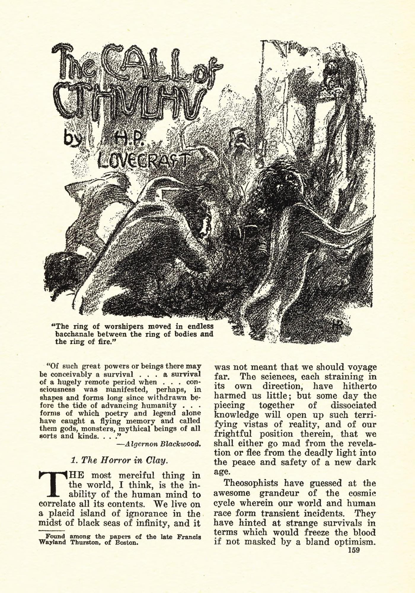
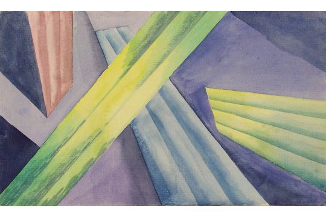
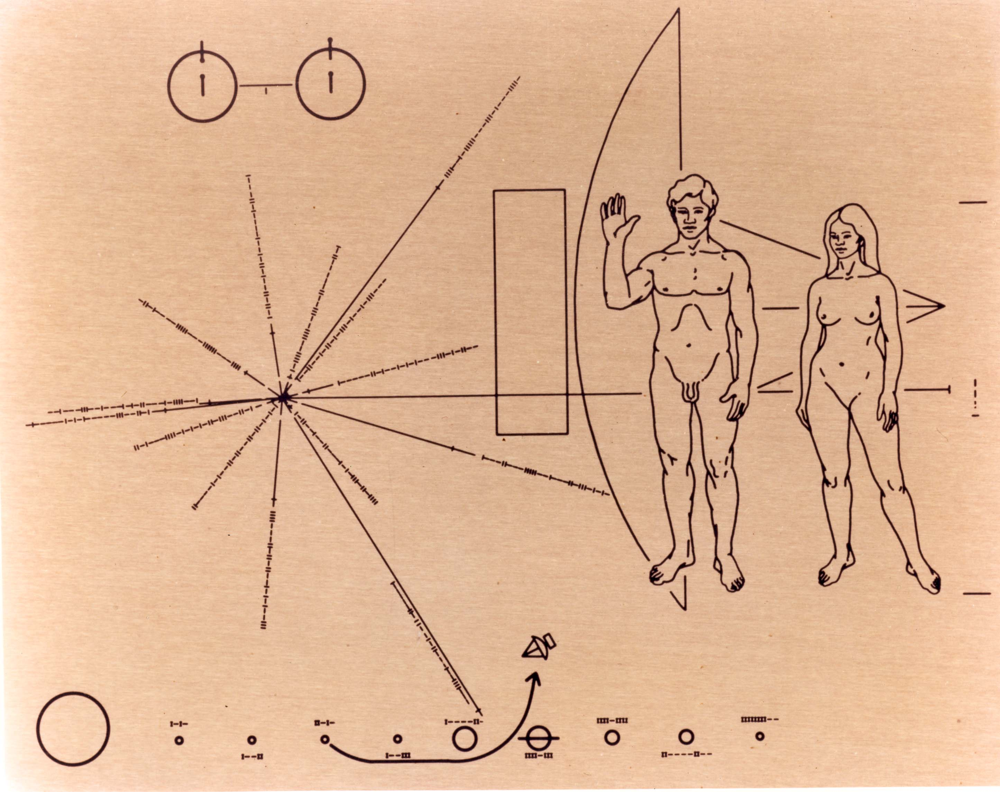
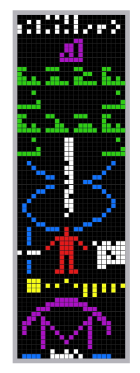
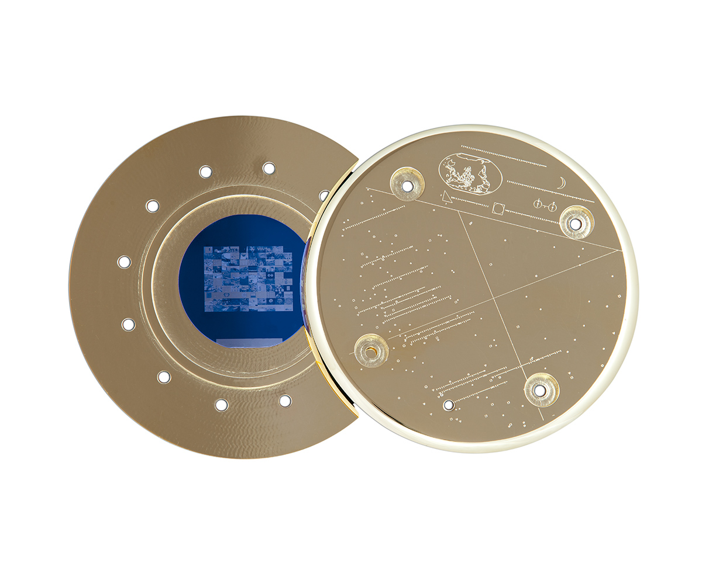
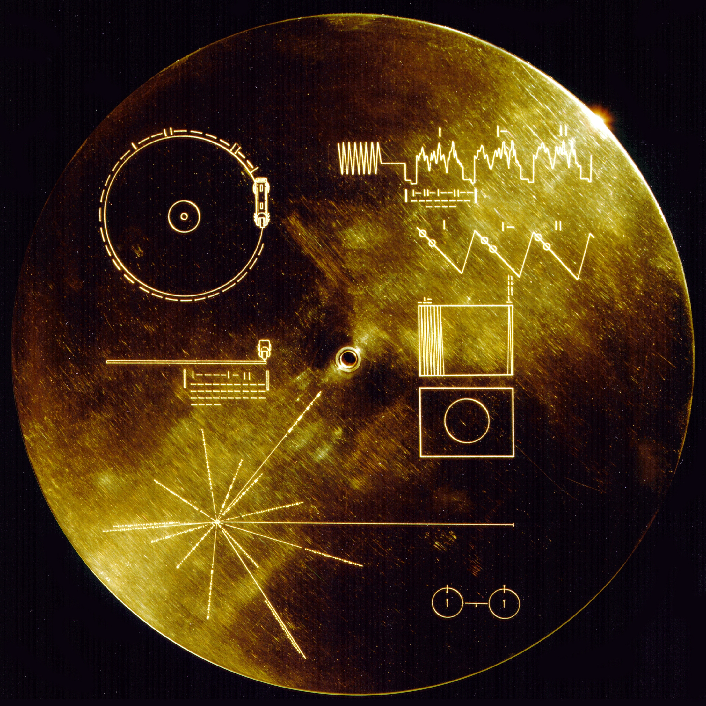
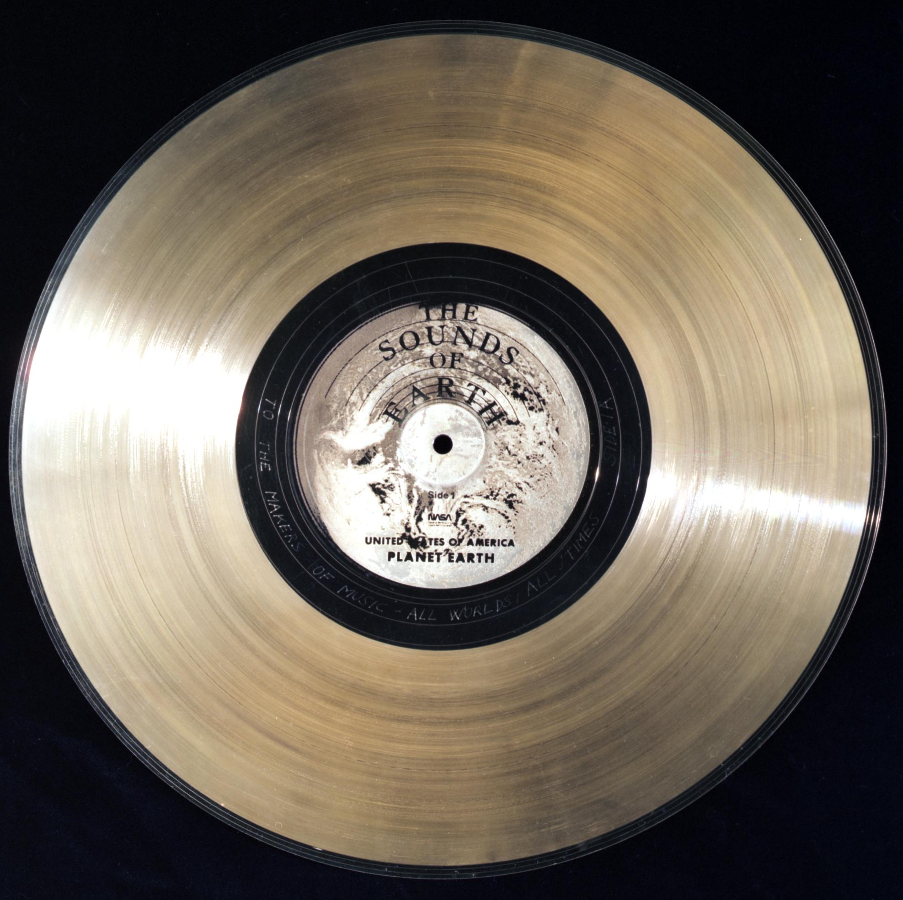

# So Much Space

*Marie Herrndorff*

Der US-Amerikaner H.P. Lovecraft hat mit der Idee vom „Cosmicism“ eine neue literarische Philosophie begründet, die maßgeblich für seine Werke war. Zentral ist dabei der Gedanke, dass der Mensch ein irrelevanter Teil des Kosmos ist und jeden Moment verschwinden könnte. Während die reale Welt durch neue wissenschaftliche Entdeckungen entzaubert wurde, versuchte Lovecraft, neue fiktive Gefahren zu erdenken, weshalb die Bedrohungen in seinen Erzählungen aus den unerreichbaren Tiefen des Kosmos kommen wie beispielsweise dem Weltall oder der Vergangenheit beziehungsweise der Zukunft. Die Menschheit ist erst so kurze Zeit Teil des Universums, dass sie noch gar keinen Einfluss auf den Kosmos nehmen konnte, und ist aus genau diesem Grund allen länger existierenden Mächten ausgeliefert - Der Mensch ist ein Fremder auf Erden.

Der russische Kosmismus dagegen ist eine kulturelle und philosophische Bewegung, die auch zur Schaffenszeit von Lovecraft aufkam. Allerdings wurde die Strömung erst in den 1970ern mit diesem Begriff benannt und hat sich diese Zuordnung nicht selbst gegeben. Die Weltanschauung der Mitglieder bringt unterschiedliche Themen der Wissenschaft, Religion und Metaphysik zusammen, die sich in der Ansicht festigen, dass sich der Menschheit durch ihren wissenschaftlichen Fortschritt die Möglichkeit bietet, unsterblich zu werden, so die Natur zu bezwingen und den Weltraum zu erforschen, wodurch schlussendlich ihre kosmische Bestimmung erfüllt werden kann. Werke wie Jules Vernes „Die Reise zum Mond“ (1870) und H. G. Wells „Die Zeitmaschine“ (1895) formten die Ideologie der Anhänger, aber auch das russisch-orthodoxe Christentum, russische Philosophie und die neuen Errungenschaften im Bereich der Naturwissenschaften der Zeit waren wichtige Einflüsse. Aus heutiger Sicht sind eindeutige Verbindungen zur sowjetischen Raumfahrt, dem Transhumanismus und der gesamten Idee der Weltraumbesiedelung / -kolonialisierung, die heute in Silicon Valley sehr prominent sind, zu erkennen.

Die Hochphase des Space Race fand in den 1950-60ern statt und offiziell gilt der Wettkampf zwischen den USA und der UDSSR bzw. heute Russland durch die Mondlandung der Apollo 11 (1969) als beendet. Das heute laufende billionaire space race kann allerdings als eindeutiger Nachfolger oder als Weiterentwicklung des ersten gesehen werden. Während das Space Race zur Zeit des Kalten Krieges ein Wettkampf zwischen den beiden mächtigsten Nationen war, ist das billionaire space race komplett losgelöst von nationalen außenpolitischen Interessen und nur noch durch extraterrestrische Business-Opportunities motiviert. Ursprünglich ging es um Propaganda zur Verbreitung einer kapitalistisch (USA-ideologisch) / kommunistisch (osteuropäisch) geprägten Weltordnung; Mittlerweile ist das Ziel die private Vermögensvergrößerung und die Umsetzung der eigenen transhumanistisch geprägten Ideologien, die fortschrittlich (westlich) verpackt werden, obwohl sie sich (möglicherweise unwissend) auf Gedanken der russischen Kosmismus-Bewegung zurück beziehen mit ihren transhumanistischen Ansätzen. Zu dieser Verzerrung kommt natürlich noch hinzu, dass das Space Race nur möglich war durch die Raketentechnikforschung des NS-Regimes, deren führende Wissenschaftler zwischen den Siegermächten aufgeteilt wurden und für diese weiterforschten.

Im vermeintlichen Gegensatz zu dieser propagandistischen Raumfahrt stehen die wenigen Versuche, dem Kosmos die Existenz der Erdbevölkerung mitzuteilen und auf eine Antwort zu hoffen – angefangen mit der Pioneer-Plakette, die an den Sonden Pioneer 10 und 11 anlässlich deren Fluges zum Jupiter befestigt wurde. Innerhalb von drei Wochen stellten Carl Sagan, Frank Drake und Linda Salzmann die Grafik zusammen, die zwei Wasserstoffatome im Hyperfeinstrukturübergang, zwei nackte Menschen, die Silhouette der Sonde selbst und das Sonnensystem zeigt. Die benutzten Darstellungsweisen sind eindeutig „europäisch-westlich“ geprägt und setzen perspektivische Sehgewohnheiten voraus, um verstehen zu können, dass ein Fluchtpunkt oder schematische Zweidimensionalität genutzt werden. Am schwerwiegendsten wurde die Benutzung eines Pfeils kritisiert, da es sehr wahrscheinlich ist, dass Lebensformen, die keinen jagenden Ursprung haben und deshalb auch keine Schusswaffen entwickelt haben, die Charakteristika dieses Objekts verstehen. Für uns Menschen ist direkt impliziert, dass der Pfeil eine Richtung und eine Bewegung anzeigt, die durch die Spitze markiert ist. Aliens könnten möglicherweise den Pfeil auf der Pioneer-Plakette, der die vage Flugbahn der Sonde anzeigt, als eine reale räumliche Struktur in unserem Sonnensystem lesen.

Die Arecibo Message wurde 1974 von Puerto Rico aus gesendet und war ein Radiowellensignal, das unter anderem von Frank Drake designed wurde. Falls die Radiowellen von einer anderen Zivilisation empfangen werden und als Bild ausgelesen werden können, könnte Folgendes zu erkennen sein: Zahlen 1 – 10, chemische Elemente bzw. DNS, Nukleotide (Bausteine der menschlichen DNS), Struktur der DNS, die Menschheit (durchschnittliche Körpergröße, Anatomie, Anzahl der Erdbevölkerung), Sonnensystem mit Position der Erde, das Arecibo Teleskop. Trotz Tests, welche die Entschlüsselbarkeit dieser Botschaften versucht haben herauszufinden, bleibt fraglich, ob Lebensformen außerhalb der Erde die Botschaften überhaupt wahrnehmen oder die verwendeten Symbole lesen könnten – abgesehen von der verschwindend geringen Wahrscheinlichkeit, dass die Nachrichten überhaupt empfangen werden.

Echostar XVI wurde erst 2012 in die Erdumlaufbahn geschossen und ist so ein sehr viel zeitgenössischeres Beispiel in dieser Reihe von archivarischen Vermittlungsversuchen zwischen Kosmos und Menschheit. An dem kommerziellen Kommunikationssatelliten der Echostar Corporation wurde das last pictures artifact, eine von dem amerikanischen Künstler Trevor Paglen kuratierte Bildersammlung, transportiert. Die Siliziumscheibe wurde von der New Yorker Organisation „creative time“ in Auftrag gegeben und wird an dem Satelliten, der nach 2027 als Weltraumschrott in einen sogenannten Friedhof geleitet wird, wahrscheinlich mehrere Milliarden Jahre weiter existieren. Das last pictures artifact soll als Denkmal für das Anthropozän mit den gespeicherten Bildern verschiedenste Arten zeigen, wie die Erde durch menschlichen Einfluss verändert wurde. Mit sehr großer Wahrscheinlichkeit wird die Menschheit nie erleben, dass die Siliziumscheibe im Weltraum entdeckt und zurück auf den Planeten gebracht wird. Die Frage ist also: Ist das Denkmal für den Kosmos insgesamt als abstrakte Lebensform gedacht? Selbst in dem unwahrscheinlichen Fall, dass extraterrestrisches Leben irgendwo im Weltraum entstanden ist, würde der Echostar-Satellit niemals in einem riesigen Feld Weltraumschrott entdeckt werden.

Das bekannteste Beispiel in dieser Reihe der versuchten Kommunikation mit dem All sind die Voyager Golden Records, die 1977 von der NASA in das All befördert wurden. An Bord der Raumsonden ist jeweils ein Datenträger in Form einer Schallplatte befestigt, die 118 Bilder (20 bunt, 98 schwarz-weiß), das 12-minütige Sound-Essay „Sounds of Earth“, 87min Musik aus unterschiedlichsten Genres und Grüße in 55 Sprachen enthält. Carl Sagan hat auch diesen Datenträger kuratiert und entworfen mit einem Team aus 10 weiteren Personen, innerhalb von 6 Wochen. Die Hülle der Schallplatte zeigt Symbole, die von der Pioneer-Plakette übernommen wurden, plus weitere schematische Darstellungen, die die Bedienung und Abspielweise der Schallplatte einem möglichen Finder erklären sollen.

Obwohl die Golden Records nach dem Ende des Space Race zusammengestellt und als große Chance der Menschheit, dem Kosmos eine Botschaft mitzuteilen, dargestellt wurden, ist aus heutiger Sicht nicht zu verleugnen, dass eine goldene Schallplatte, verziert mit einem Abdruck der Blue Marble und der händischen Unterschrift „to the makers of music – all worlds all times“, das Selbstverständnis der Gruppe und ihrer Arbeit enthüllt. Abgesehen davon ist natürlich ein goldenes Objekt, was die gesamte Weltbevölkerung vertreten soll, als eine Zurschaustellung von weltlicher sowie westlicher Dekadenz zu lesen, auch wenn die beabsichtigte Botschaft von Carl Sagan und seinem Team als ein selbstaufopfernder Dienst im Sinne der Menschheit gemeint war. Die Voyager Golden Records sind in jeder Facette ihres güldenen Glanzes das perfekte NASA-Prestige-Objekt: von der strahlenden Symbolkraft des Materials bis zu dem Gruß von Kurt Waldheim dem UN-Generalsekretär 1972–1981, einem ehemaligen SA-Mitglied und Kriegsverbrecher.
